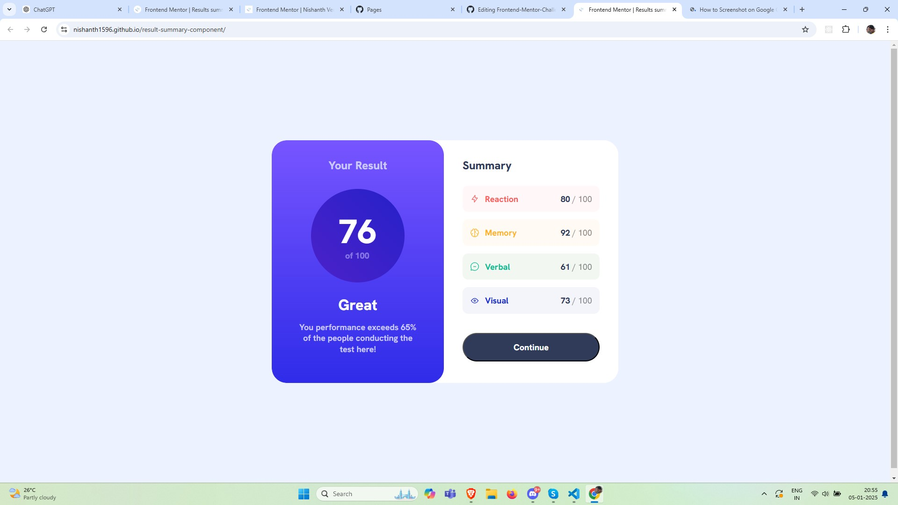

# Frontend Mentor - Results Summary Component Solution

This is a solution to the [Results Summary Component Challenge](https://www.frontendmentor.io/challenges/results-summary-component-CE_K6s0maV) on Frontend Mentor. The challenge helps you improve your coding skills by building a real-world project with a focus on responsive design and accessibility.

## Table of Contents

- [Overview](#overview)
  - [The Challenge](#the-challenge)
  - [Screenshot](#screenshot)
  - [Links](#links)
- [My Process](#my-process)
  - [Built With](#built-with)
  - [What I Learned](#what-i-learned)
  - [Continued Development](#continued-development)
  - [Useful Resources](#useful-resources)
- [Author](#author)
- [Acknowledgments](#acknowledgments)

## Overview

### The Challenge

Users should be able to:

- View the optimal layout for the interface depending on their device's screen size.
- See hover and focus states for all interactive elements on the page.

### Screenshot

### Links

- Solution URL: [solution URL](https://github.com/nishanth1596/result-summary-component)
- Live Site URL: [live site URL]()

## My Process

### Built With

- Semantic HTML5 markup
- CSS custom properties
- Flexbox
- Desktop-first workflow

### What I Learned

Through this project, I learned how to:

1. **Implement responsive design**: The challenge allowed me to practice using media queries and flexible layouts like Flexbox to ensure the page looks great across different screen sizes.
2. **Work with CSS gradients**: I used linear gradients to style the background elements, learning how to properly apply multiple gradient colors in a seamless way.
3. **Font management**: I integrated custom fonts from Google Fonts and made sure they were applied correctly across different screen sizes.

### Continued development

I would like to continue practicing more complex layout techniques, especially working with Flexbox and Grid. I also aim to improve my skills in optimizing images for the web.

### Useful resources

MDN Web Docs - Flexbox - This documentation helped me understand Flexbox better.
Google Fonts - I used the Outfit font from Google Fonts to style the text.

### Author

- Name: Nishanth
- Website - [My GitHub Profile](https://github.com/nishanth1596)
- Frontend Mentor - [@nishanth1596](https://www.frontendmentor.io/profile/nishanth1596)
- Twitter - [@nishanth1596](https://x.com/nishanth1596)

### Acknowledgments

A special thanks to the Frontend Mentor community for providing inspiration and feedback on this project. The resources provided by the platform were very helpful in getting me to the solution.
